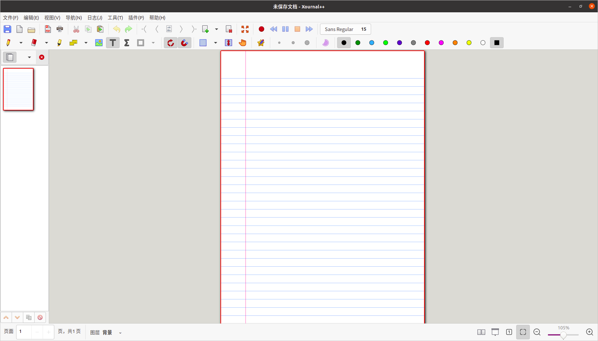

1. net-tools

   > 网络诊断工具。
   
   ```bash
   sudo apt-get install net-tools
   ```

2. alacarte

   > 收藏夹Dock管理器（主菜单）。使用这个 GUI 工具，免去了每次都手动添加 ` .desktop` 文件的麻烦。

   ```bash
   sudo apt install alacarte
   ```

   

3. 数据库
   - mysql-workbench

4. 视频播放软件：

   - [ smplayer](https://www.smplayer.info/)

     ```bash
     sudo snap install smplayer
     ```

   - VLC播放器：VLC Media Player

     ```bash
     # 安装
     sudo apt-get install vlc
     # 启动
     vlc
     ```


5. 画图软件

   - Xournal++

     文件后缀名为 .xopp
     
     

   - kolourpaint

     ```bash
     sudo apt-get install kolourpaint
     ```

     > 参考：[绘图工具](https://blog.csdn.net/jiesunliu3215/article/details/108854739)

   - iodraw

   - drawio

     > [github下载地址](https://github.com/jgraph/drawio-desktop)

   - dia

     > 支持UML+流程图＋基础图形

     ```bash
     # 安装:
     apt-get install dia-common
     # 运行
     dia
     ```

6. 云笔记
   - NixNote2

7. 词典
   - GoldenDict

     ```bash
     sudo apt-get install goldendict
     ```
   
8. 编辑器

   - typora

   - qtcreator

   - vscode

   - IDEA


9. 社交软件
   - QQ


10. VPN
    - eletron-ssr


11. gvim

    > vim 的增强版。

12. 

    