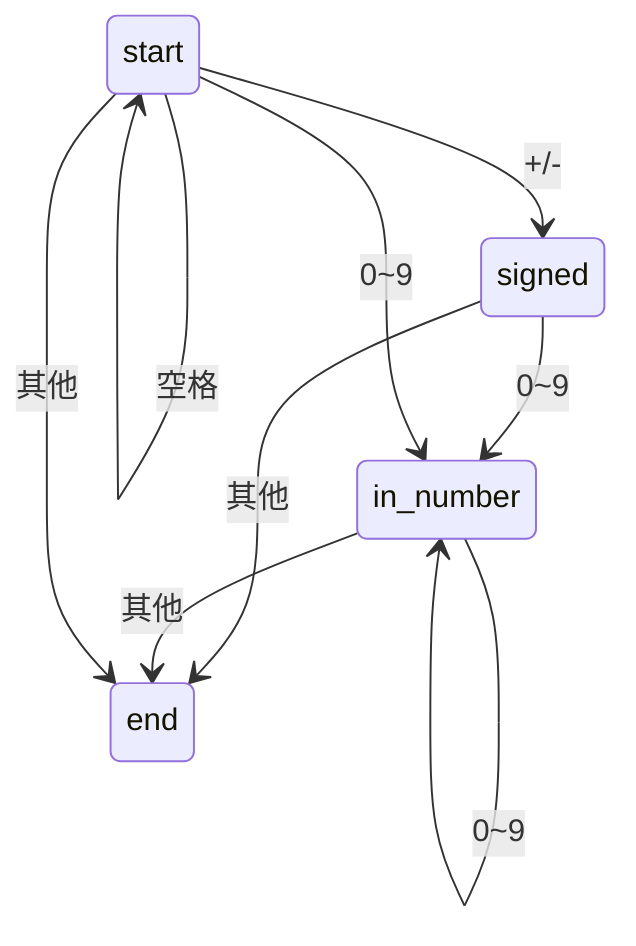

# 自动机（Automaton）

字符一个个输入，状态随之变化如下图：

```mermaid
stateDiagram-v2

signed-->in_number:0~9
signed-->end:其他

in_number-->in_number:0~9
in_number-->end:其他

start-->start:空格
start-->signed:+/-
start-->in_number:0~9
start-->end:其他
```

