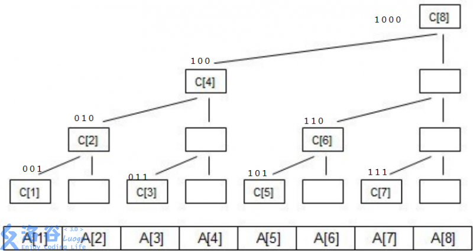

# 树状数组


## 概念

用数组来模拟二叉树，不需要真的建树。

树状数组与线段树相似，但是节点少很多，如果n个数用树状数组表示，那么其实际节点数就是n。

节点：C[x]，表示从A[x]开始，向左长度为lowbit(x)的连续区间的和。其中，A[]表示实际数组，lowbit(x)见后文。本文表示的下标都从1开始。
$$
C[x]=A[x]+A[x-1]+...+A[x-lowbit(x)+1]
，其中x=1,...,n
$$

| 下标x（十进制） | 下标x（二进制） | lowbit（二进制） | C[x]管辖的区间长度=lowbit(x) | C[x]所处二叉树的高度=log(lowbit(x))+1（最低层高度为1） |
| --------------- | --------------- | ---------------- | ---------------------------- | ------------------------------------------------------ |
| 1               | 0001            | 0001             | 1                            | 1                                                      |
| 2               | 0010            | 0010             | 2                            | 2                                                      |
| 3               | 0011            | 0001             | 1                            | 1                                                      |
| 4               | 0100            | 0100             | 4                            | 3                                                      |
| 5               | 0101            | 0001             | 1                            | 1                                                      |
| 6               | 0110            | 0010             | 2                            | 2                                                      |
| 7               | 0111            | 0001             | 1                            | 1                                                      |
| 8               | 1000            | 1000             | 8                            | 4                                                      |
| 9               | 1001            | 0001             | 1                            | 1                                                      |
| 10              | 1010            | 0010             | 2                            | 2                                                      |
| 11              | 1011            | 0001             | 1                            | 1                                                      |
| 12              | 1100            | 0100             | 4                            | 3                                                      |
| 13              | 1101            | 0001             | 1                            | 1                                                      |
| 14              | 1110            | 0010             | 2                            | 2                                                      |
| 15              | 1111            | 0001             | 1                            | 1                                                      |
| 16              | 10000           | 10000            | 16                           | 5                                                      |

树状数组绘图如下，其中空白节点是虚拟节点，在内存中并不存在。




## lowbit

节点C[x]管辖的区间长度为保留x最低位的1、其他二进制位置0表示的数的大小，比如6（二进制为0110），最低的1位于倒数第二位，那么其管辖的区间长度为lowbit(6)=lowbit(0110b)=0010b=2。

lowbit(x)的代码如下，可以通过二进制表示、补码等来证明。

```cpp
// C[x]管辖的区间长度
int lowbit(x) {
    return x & -x;
}
```


## 单点修改

为了方便起见，我们可以假设 **更新操作** 为“对第x个数加上k”，即 
$$
A[x]+=k
$$
注意到，我们需要对所有管辖范围包含A[x]的C[x]节点进行更新，也就是对A[x]的所有父节点进行更新（都需要加上k）。这里的“父节点”指的是实际节点，不包含虚拟节点，因为虚拟节点不存在，比如C[6]的父节点为C[8]。

观察二叉树可得：
$$
（实际）父节点下标=（实际）子节点下标x+lowbit(x)
$$
定性证明：观察包含虚拟节点的二叉树，树状数组是一个满二叉树。满二叉树的特点是：

- 父树节点数=左子树节点数+右子树节点数
- 左子树节点数=右子树节点数=lowbit(x)

得证。

```cpp
// 一次A[x]+=k操作之后更新树状数组
void add(int x, int k) {
    // 更新当前节点及其所有父节点
    for(int i=x;i<=n;i+=lowbit(i)) {
        tree[i] += k;
    }
}
```


## 建树

树状数组并不需要真的建立树状结构。本节指的是从0到n个数字加入到树状数组的更新过程。

A[x]初始化为0：

```cpp
int tree[n] = {0};
```

那么把从0到n个数字加入到树状数组，也就是不断进行A[x]+=k的更新操作：

```cpp
for(int i=1;i<=n;i++) {
    cin >> a; // 输入A[i]，i从1开始
    add(i, a);
}
```


## 前缀和

树状数组可以很方便地计算前缀和：

假设要求
$$
A[1]+A[2]+...+A[7]
$$
的前缀和。

观察二叉树图，可得
$$
ans=C[7]+C[6]+C[4]
$$
写成二进制：
$$
ans=C[0111]+C[0110]+C[0100]
$$
注意到C[x]下标x变化：
$$
x=0111\\
x=x-lowbit(x)=0111-0001=0110\\
x=x-lowbit(x)=0110-0010=0100\\
x=x-lowbit(x)=0100-lowbit(0100)=0，下标为0无意义
$$
伪代码：

```cpp
// A[1]+...+A[x]的前缀和
int sum(int x) {
    int ans = 0;
    for(int i=x;i>=1;i-=lowbit(i)) {
        ans += tree[i];
    }
    return ans; // 注意到sum(0)=0
}
```


## 区间查询

就是前缀和。
$$
A[x]+A[x+1]+...+A[y]=sum(y)-sum(x-1)
$$


## 单点查询

就是区间查询。
$$
A[x]=sum(x)-sum(x-1)
$$


## 时间复杂度

查询/更新：O(logn)


## 优缺点


## 参考链接

[树状数组详解]: https://www.cnblogs.com/xenny/p/9739600.html	"树状数组详解"
[luogu P3374题解]: https://www.luogu.com.cn/problem/solution/P3374	"luogu P3374题解"

