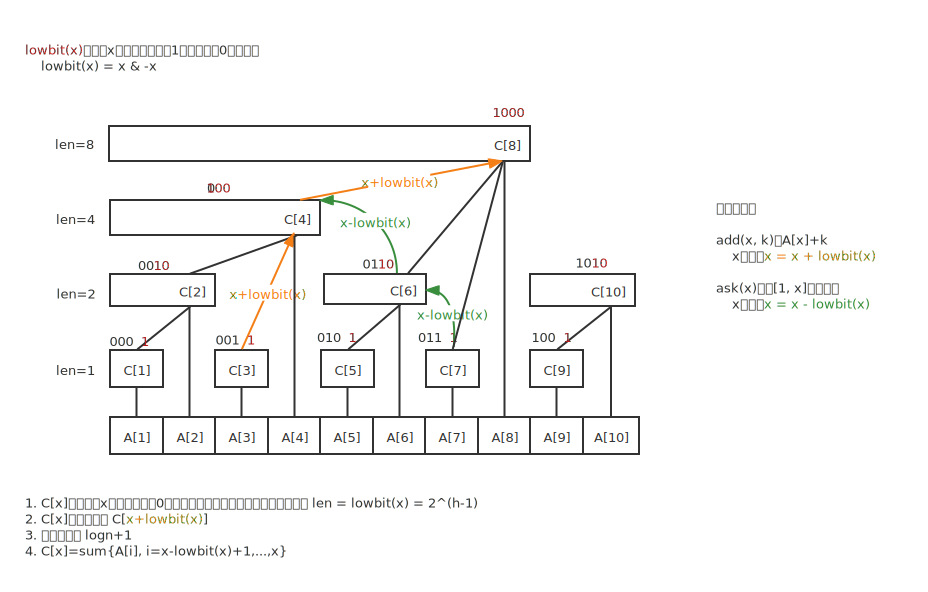

# 树状数组


## 定义

设原数组
$$
A[x],其中x=1,2,...,n
$$
现构建树状数组
$$
C[x]=A[x]+A[x-1]+...+A[x-lowbit(x)+1]=\sum_{i=x-lowbit(x)+1}^{x}{A[i]}
，其中x=1,...,n
$$
其中，C[x]表示从A[x]开始、向左取长度为lowbit(x)的**连续区间的和**。lowbit(x)见后文。

树状数组的树形结构如下：



可以看出，树状数组本质上是个数组，没有唯一的根，访问时按照下标x访问。

树状数组与线段树相似，但是节点少很多，如果n个数用树状数组表示，那么其实际节点数就是n。


## lowbit

lowbit(x)表示x二进制最低位的1和其末尾的0组成的数，比如6（二进制为0110），lowbit(6)=lowbit(0110b)=0010b=2。

定义一个Lowbit函数，返回参数转为二进制后,最后一个1的位置所代表的数值。--- 百度百科《树状数组》

lowbit(x)恰好等于C[x]覆盖的区间长度。

lowbit(x)的代码如下，可以通过二进制表示、补码等来证明。

```cpp
// C[x]管辖的区间长度
int lowbit(x) {
    return x & -x;
}
```


## 性质

观察树形结构，可得：

1. C[x]每层下标x二进制末尾的0都相同，并且等于其覆盖的区间长度，即 len = lowbit(x) = $2^{h-1}$，其中h表示二叉树的高度。
2. C[x]的父节点为 C[x+lowbit(x)]，如树形结构图的黄色箭头所示。
3. 树的深度为 $log_2n+1$ 。


## 查询前缀和

从定义可知，树状数组每个节点C[x]表示一段区间和。

假设要求
$$
A[1]+A[2]+...+A[7]
$$
的前缀和。

从树形结构的绿色箭头所示
$$
ans=C[7]+C[6]+C[4]
$$
写成二进制：
$$
ans=C[0111]+C[0110]+C[0100]
$$
注意到C[x]下标x变化：
$$
\begin{align}
x=&0111\\
x=&x-lowbit(x)=0111-0001=0110\\
x=&x-lowbit(x)=0110-0010=0100\\
x=&x-lowbit(x)=0100-lowbit(0100)=0，下标为0无意义
\end{align}
$$
伪代码：

```cpp
// 求A[1]+...+A[x]的前缀和
// 时间复杂度O(logn)
int ask(int x) {
    int ans = 0;
    while(x > 0) {
        ans += tree[x];
        x -= lowbit(x);
    }
    return ans; // 注意到sum(0)=0
}
```


## 差分数组

**差分数组：**
$$
C[x]=A[x]-A[x-1]
$$


| index    | 1    | 2    | 3    | 4    | 5    | 6    | 7    |
| -------- | ---- | ---- | ---- | ---- | ---- | ---- | ---- |
| 原数组   | 2    | 8    | 6    | 1    | 3    | 7    | 5    |
| 差分数组 | 2    | 6    | -2   | -5   | 2    | 4    | -2   |

**性质1：**

> A[x]等于差分数组的前缀和，即

$$
A[x]=\sum_{i=1}^xC[i]
$$

证明：

$$
\begin{align}
C[x]&=A[x]-A[x-1]\\
C[x-1]&=A[x-1]-A[x-2]\\
...\\
C[2]&=A[2]-A[1]\\
C[1]&=A[1]-0\\
\end{align}
$$


以上各式相加，即可得证。

**性质2：**

> 若对原数组区间[x,y]每个数加上k，那么C[x]+=k, C[y+1]+=-k，差分数组其他位置不变。

现在我们对区间[2,4]的每个数加上3：

| x            | 1    | ==<u>2</u>==  | ==<u>3</u>== | ==<u>4</u>== | 5              | 6    | 7    | 8    |
| ------------ | ---- | ------------- | ------------ | ------------ | -------------- | ---- | ---- | ---- |
| 原数组A[x]   | 2    | ~~8~~ 11      | ~~6~~ 9      | ~~1~~ 4      | 3              | 7    | 5    | 12   |
| 差分数组C[x] | 2    | ==~~6~~ *9*== | -2           | -5           | ==~~2~~ *-1*== | 4    | -2   | 7    |

那么，只有C[2]+=3, C[5]+=-3.


## 单点修改

为了方便起见，我们可以假设 **更新操作** 为“对第x个数加上k”，即 
$$
A[x]+=k
$$
注意到，我们需要对所有覆盖A[x]的C[x]节点进行更新，也就是对A[x]的所有父节点进行更新（都需要加上k）。

如树状图的黄色箭头所示
$$
父节点下标=子节点下标x+lowbit(x)
$$
定性证明：如果我们重画树状结构如下


那么，树状数组是一个满二叉树。满二叉树的特点是：

- 父树节点数=左子树节点数+右子树节点数
- 左子树节点数=右子树节点数=lowbit(x)

得证。

```cpp
// 一次A[x]+=k操作之后更新树状数组
// 时间复杂度O(logn)
void add(int x, int k) {
    // 更新当前节点及其所有父节点
    for(int i=x;i<=n;i+=lowbit(i)) {
        tree[i] += k;
    }
}
```


## 区间修改、单点查询

对区间[x,y]内每个数加上k。

若干次修改区间修改后，查询某个数。

### 方法一：差分数组

C[]保存差分数组，即
$$
C[x]=A[x]-A[x-1]
$$
若对原数组区间[x,y]每个数加上k，那么根据差分数组性质二，只需要$C[x]+=k, C[y+1]+=-k$。

查询
$$
A[x]=\sum_{i=1}^xC[i]
$$

```cpp
int input[n]; // 原数组
int tree[n];

// tree初始化
void init() {
    for(int i=1;i<=n;i++)
        tree[i] = input[i] - input[i-1]; // tree[]保存差分数组
}

// 单点查询
int query(int x) {
    return ask(x); // 前缀和即为A[x]
}
```


### 方法二：前缀和

C[x]初始化为0：

| x      | 1    | 2    | 3    | 4    | 5    | 6    | 7    | 8    |
| ------ | ---- | ---- | ---- | ---- | ---- | ---- | ---- | ---- |
| C[x]   | 0    | 0    | 0    | 0    | 0    | 0    | 0    | 0    |
| 前缀和 | 0    | 0    | 0    | 0    | 0    | 0    | 0    | 0    |


假设A[]区间[2,4]都加上2，那么我们对C[2]+=2，C[5]+=-2。

| x      | 1    | ==2== | ==3== | ==4== | 5      | 6    | 7    | 8    |
| ------ | ---- | ----- | ----- | ----- | ------ | ---- | ---- | ---- |
| C[x]   | 0    | ==2== | 0     | 0     | ==-2== | 0    | 0    | 0    |
| 前缀和 | 0    | ==2== | ==2== | ==2== | 0      | 0    | 0    | 0    |

可以看到，[2,4]区间的前缀和都加上了2，而其他位置的前缀和都没有发生变化。

查询
$$
A[x]=A[x]+\sum_{i=1}^xC[i]
$$
即 A[x]=A[x]+{C[x]前缀和}。

```cpp
int input[n]; // 原数组
int tree[n]; // 全局变量默认初始化为0

// 无需额外处理tree[]

// 单点查询
int query(int x) {
    return input(x) + ask(x); // 原值加上前缀和即可
}
```


## 单点修改、查询区间和

若干次单点修改之后，查询某段区间内所有数的和。

tree[]初始化为前缀和。

```cpp
int tree[n]; // 默认初始化为0

// tree[]初始化为前缀和
// 时间复杂度O(nlogn)
int init() {
    for(int i=1;i<=n;i++) {
        cin >> a; // 输入A[i]，i从1开始
        add(i, a);
	}
}

// 查询[x,y]区间和
int query(int x, int y) {
    return ask(y) - ask(x-1); // 区间和=前缀和之差
}
```


## 时间复杂度

时间复杂度为 O(mlogn)，其中m为操作次数，n为数组大小。

如果不引入树状数组，那么，

1. 暴力求解：单点修改时间复杂度O(1)，但是每次区间查询时，时间复杂度最坏为O(n)，m次查询总时间复杂度为O(mn)，这是二次方的时间，很慢。
2. 维护前缀和：我们每次修改之后，维护前缀和数组每次最坏需要 O(n) 时间，m次操作的总时间复杂度为 O(mn) ，没有改善。

## 优缺点

**优点：**可以以 logn 时间查询、维护前缀和。


## 参考链接

[树状数组详解]: https://www.cnblogs.com/xenny/p/9739600.html	"树状数组详解"
[luogu P3374题解]: https://www.luogu.com.cn/problem/solution/P3374	"（用户TJor）"

[luogu P3368题解]: https://www.luogu.com.cn/problem/solution/P3368	"（用户Lyp10000）"

