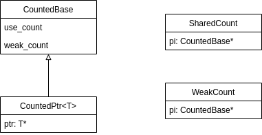

## GCC 并发编程

[官方文档](https://gcc.gnu.org/onlinedocs/libstdc++/manual/ext_concurrency.html)

## 类图

## shared_ptr 

成员：

​	pi: CountedPtr

构造：

​	shared_ptr(T* p) {

​		pi = new CountedPtr();

​		pi->weak_count = 1;

​		pi->use_count(1);

​		pi->ptr = p;

​	}

复制：

​	++pi->use_count;

析构：

​	if (--pi->use_count == 0) {

​		delete pi->ptr; // 释放资源

​		if (--weak_count == 0)

​			delete pi; // countedBase

​	}

## weak_ptr

成员：

​	pi: CountedPtr

构造：

​	weak_ptr(const shared_ptr& \__r): pi(__r.pi) {

​		++pi->weak_count;

​	}

复制：

​	++pi->weak_count;

析构：

​	if (--pi->weak_count == 0)

​		delete pi; // CountedBase
